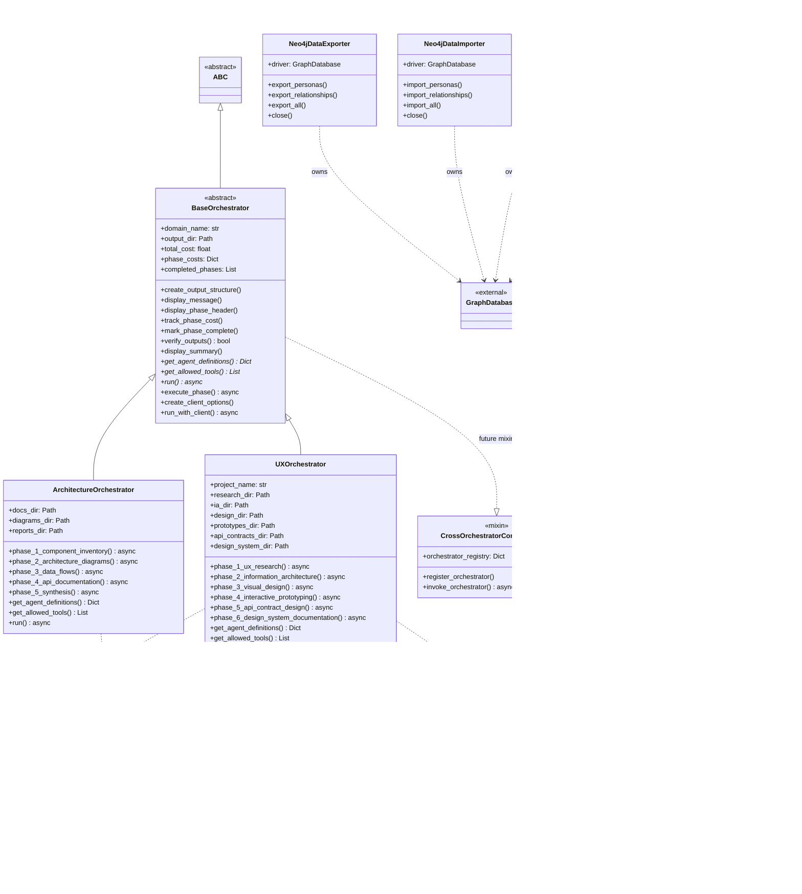

# Architecture Diagrams

This document provides comprehensive architectural visualizations of the Lila MCP (Model Context Protocol) system, which consists of two main subsystems: a psychological relationship modeling MCP server and a repository analyzer framework for multi-domain code analysis.

## System Architecture

The system follows a layered architecture pattern with clear separation of concerns across presentation, application, domain, and data layers.

**Explanation**: The system architecture demonstrates a clean separation of concerns across four distinct layers:

- **Presentation Layer**: Exposes MCP servers (`LilaMCPServer` and `SimpleLilaMCPServer`) that provide resources, tools, and prompts for psychological relationship modeling. CLI tools handle data import/export operations with Neo4j.

- **Application Layer**: Houses the orchestrator framework with `BaseOrchestrator` providing core functionality and specialized orchestrators (`ArchitectureOrchestrator`, `UXOrchestrator`) implementing domain-specific workflows. Each orchestrator manages multi-phase analysis pipelines.

- **Domain Layer**: Contains reusable agent definitions (loaded from JSON), the agent registry for discovery and instantiation, and tool integrations for MCP servers and external services like Figma.

- **Data Layer**: Persists data to Neo4j (for psychological relationship modeling) and the file system (for analysis outputs in timestamped directories under `ra_output/`). Agent configurations are stored as JSON files in `ra_agents/`.

This architecture supports modularity, reusability, and clear dependency flow from top to bottom, while leveraging external frameworks (FastMCP, Claude Agent SDK) for MCP protocol implementation and agent orchestration.

## Component Relationships

The component relationship diagram illustrates how the main subsystems interact and depend on each other.

**Explanation**: This diagram reveals the dual-nature architecture of the system:

**MCP Server Subsystem** (left):
- `LilaMCPServer` provides full Neo4j integration for psychological relationship modeling
- `SimpleLilaMCPServer` offers a mock-data fallback for testing and development
- Both expose the same MCP interface (resources, tools, prompts) ensuring compatibility
- Resources provide read access to psychological data (personas, relationships, interactions)
- Tools enable mutations (updating metrics, recording interactions, analyzing compatibility)
- Prompts guide AI-assisted psychological assessment and response generation

**Orchestrator Framework Subsystem** (center):
- `BaseOrchestrator` defines the abstract framework for multi-phase analysis workflows
- Concrete orchestrators (`ArchitectureOrchestrator`, `UXOrchestrator`) implement domain-specific phases
- Each orchestrator uses specialized agents loaded dynamically from JSON definitions
- The framework manages phase execution, progress tracking, cost accounting, and output verification
- Integration with Claude Agent SDK enables AI-powered analysis and documentation generation

**Agent & Tool Registry** (right):
- `AgentRegistry` provides dynamic discovery and loading of agent definitions from JSON files
- `MCPRegistry` discovers available MCP servers (Figma, v0, Playwright) for tool integration
- `FigmaIntegration` bridges Figma MCP server and REST API for design workflow support

**Data Access Layer** (bottom):
- Import/export utilities provide bulk data operations with Neo4j
- Orchestrators write analysis outputs to timestamped directories in the file system

**Cross-cutting Concerns**:
- `CrossOrchestratorCommunication` mixin (future) will enable orchestrators to invoke each other for validation and integration (e.g., UX orchestrator validating API contracts with Architecture orchestrator)

## Class Hierarchies

The class hierarchy diagram shows inheritance relationships and key composition patterns.

**Explanation**: The class hierarchy reveals several key architectural patterns:

**Abstract Template Pattern** (`BaseOrchestrator`):
- Inherits from Python's `ABC` to enforce implementation of abstract methods
- Provides template methods (`run_with_client()`) that orchestrate the workflow
- Forces subclasses to implement `get_agent_definitions()`, `get_allowed_tools()`, and `run()`
- Encapsulates common functionality: phase execution, progress tracking, cost accounting, output verification
- Enables polymorphic orchestrator usage and extensibility for new domains

**Concrete Orchestrator Implementations**:
- `ArchitectureOrchestrator`: Implements 5-phase repository analysis workflow (inventory → diagrams → data flows → API docs → synthesis)
- `UXOrchestrator`: Implements 6-phase UX design workflow (research → IA → design → prototyping → API contracts → design system)
- Both orchestrators define domain-specific directory structures and phase methods
- Phase methods are private (by convention) and called from the public `run()` method

**MCP Server Variants**:
- `LilaMCPServer` and `SimpleLilaMCPServer` are parallel implementations (no shared base class)
- Both follow the same pattern: `_setup_database()`, `_register_resources/tools/prompts()`, `run_server()`
- `SimpleLilaMCPServer` includes mock data fallback for offline/testing scenarios
- Both own a Neo4j `GraphDatabase` driver for data persistence

**Registry Pattern**:
- `AgentRegistry`: Discovers and caches agent definitions from JSON files, supports domain-scoped queries
- `MCPRegistry`: Auto-discovers available MCP servers and validates tool availability, provides fallback strategies

**Strategy Pattern** (via composition):
- Orchestrators compose with registries to dynamically load agents and tools
- `FigmaIntegration` provides pluggable Figma API access with MCP fallback
- `CrossOrchestratorCommunication` mixin (future) will enable cross-domain collaboration

**Data Access Layer**:
- `Neo4jDataImporter` and `Neo4jDataExporter` provide bulk operations on Neo4j
- Both own a `GraphDatabase` driver with lifecycle management (close method)

**External Dependencies**:
- `FastMCP`: MCP protocol implementation framework
- `GraphDatabase`: Neo4j Python driver
- `AgentDefinition`: Claude Agent SDK agent configuration
- `ClaudeSDKClient`: AI agent execution runtime (used in BaseOrchestrator)

## Module Dependencies

The module dependency graph shows how Python modules import and depend on each other.

**Explanation**: The module dependency graph illustrates the layered and modular nature of the codebase:

**Package Organization**:
- **ra_orchestrators/**: Contains the orchestrator framework with clear internal dependencies (`ArchitectureOrchestrator` → `BaseOrchestrator`)
- **ra_agents/**: Houses agent registry and JSON agent definitions organized by domain (architecture/, ux/)
- **ra_tools/**: Provides tool integration utilities (MCP registry, Figma integration)
- **Root level**: MCP servers, data utilities, and tests

**Dependency Layers** (bottom-up):

1. **External Dependencies** (foundation):
   - `claude_agent_sdk`: AI agent orchestration framework (AgentDefinition, ClaudeSDKClient, message types)
   - `fastmcp`: MCP protocol implementation (FastMCP, Resource, Tool, Prompt decorators)
   - `neo4j`: Graph database driver for psychological data persistence
   - Python stdlib: Standard library modules (asyncio, pathlib, typing, json, os, datetime)

2. **Core Utilities** (middle layer):
   - `AgentRegistry`: Loads agent definitions from JSON files, no dependencies on other ra_* modules
   - `MCPRegistry`: Discovers MCP servers, standalone utility
   - `FigmaIntegration`: Figma API integration, standalone utility
   - Data utilities (`import_data.py`, `export_data.py`): Direct Neo4j access, no orchestrator dependencies

3. **Orchestrator Framework** (top layer):
   - `BaseOrchestrator`: Depends only on Claude Agent SDK and stdlib
   - `ArchitectureOrchestrator`: Depends on `BaseOrchestrator`, `AgentRegistry`, and SDK
   - `UXOrchestrator`: Depends on `BaseOrchestrator`, `AgentRegistry`, `MCPRegistry`, `FigmaIntegration`, and SDK
   - `architecture.py` (legacy): Standalone implementation before refactoring to base framework

4. **MCP Servers** (parallel to orchestrators):
   - `LilaMCPServer` and `SimpleLilaMCPServer`: Depend on FastMCP and Neo4j, independent of orchestrator framework
   - Enable the "Lila as MCP server" use case separate from "Lila analysis framework" use case

**Key Dependency Patterns**:

- **No circular dependencies**: Clean acyclic graph structure
- **Minimal coupling**: Packages depend on interfaces (SDK types) rather than implementations
- **Plugin architecture**: Orchestrators discover agents and tools via registries (dependency inversion)
- **Parallel subsystems**: MCP servers and orchestrator framework are independent, can be used separately
- **Test isolation**: Tests depend on specific modules under test, not the entire system

**Import Conventions**:
- Relative imports within packages (e.g., `from .base_orchestrator import BaseOrchestrator`)
- Absolute imports for external dependencies (e.g., `from claude_agent_sdk import AgentDefinition`)
- Package `__init__.py` files expose key classes for easier imports

**Data Flow**:
- JSON agent definitions → `AgentRegistry` → Orchestrators → `ClaudeSDKClient` → Analysis outputs
- Neo4j data → MCP servers → MCP protocol → Claude Code
- Repository files → Orchestrators (via Read/Grep/Glob tools) → Analysis outputs (via Write tool)

This modular architecture supports:
- **Independent development**: MCP servers, orchestrators, and utilities can evolve separately
- **Reusability**: Agent registry and tool integrations are shared across orchestrators
- **Testability**: Each module can be tested in isolation with minimal mocking
- **Portability**: The ra_* framework can be dropped into any repository without conflicts
- **Extensibility**: New orchestrators can be added by implementing the `BaseOrchestrator` interface
