# Data Flow Analysis

## Query Flow

The query flow represents the basic request-response cycle for MCP resource and tool invocations. This is the foundational flow pattern used throughout the Lila MCP system.

**Explanation**: This flow shows how a simple query traverses the system:

- **Entry Point**: Client sends MCP request to server (lines 72-114 in lila_mcp_server.py for resources, 300-609 for tools)
- **Routing**: FastMCP framework routes to decorated handlers (@self.app.resource or @self.app.tool)
- **Database Query**: For resources, Cypher query executes via session.run() (e.g., line 80-87 for get_all_personas)
- **Data Transformation**: Neo4j records transformed to JSON strings (lines 89-111)
- **Return Path**: JSON response flows back through FastMCP to client
- **Error Handling**: Try-catch blocks handle database errors (lines 112-114), return error JSON

**Performance Considerations**: Database queries use WITH context manager for automatic connection cleanup (line 79). Connection pooling managed by Neo4j driver initialized at lines 48-62.

## Interactive Session Flow

Interactive sessions enable stateful, multi-turn conversations with context preservation. This flow demonstrates how the system maintains state across multiple requests.

**Explanation**: The interactive session flow manages stateful conversations:

- **Session Initialization**: Client establishes session, server creates context (implicit in simple_lila_mcp_server.py initialization, lines 36-100)
- **State Management**: Mock data stored in self.mock_personas (lines 42-71), self.mock_relationships (lines 73-80), self.mock_interactions (lines 82-92)
- **Multi-turn Processing**: Each request reads current state, processes changes, updates state
  - Example: update_relationship_metrics (lines 363-400) reads current metrics (lines 376-384), applies deltas (lines 387-390)
  - record_interaction (lines 402-435) appends to interactions list (line 423)
- **State Persistence**: finalize_demo_session tool (lines 621-631) commits all relationship states
- **Session Cleanup**: Session context cleared, resources released

**State Handling**: In-memory state used for simplified demo (simple_lila_mcp_server.py). Production version (lila_mcp_server.py) uses Neo4j for persistence with transaction management (lines 313-357).

## Tool Permission Callback Flow

Tool permission callbacks enable user-controlled authorization for potentially sensitive operations. This flow shows the approval mechanism before executing privileged tools.

**Explanation**: Permission callbacks provide granular control over tool execution:

- **Permission Check**: Before tool execution, SDK checks permission_mode (configured in ClaudeAgentOptions)
- **Permission Modes**:
  - `ask`: User prompted for every tool invocation
  - `acceptEdits`: Auto-approve file edits (Read, Write, Grep, Glob), prompt for others
  - `accept`: Auto-approve all tools (used in orchestrators, line 272 in base_orchestrator.py)
- **User Interaction**: For "ask" mode, user sees:
  - Tool name (e.g., "update_relationship_metrics")
  - Parameters with values
  - Approve/Deny buttons
- **Tool Execution**: On approval, tool executes normally (e.g., update_relationship_metrics at lines 301-360 in lila_mcp_server.py)
- **Error Handling**: Denial returns permission error to client without executing tool
- **Security**: Prevents unauthorized data modifications, especially for destructive operations

**Code References**:
- Permission mode set in orchestrators: base_orchestrator.py:272
- Tool decorators: lila_mcp_server.py:300 (@self.app.tool())
- Allowed tools list: base_orchestrator.py:106-112, architecture_orchestrator.py:106-112

## MCP Server Communication Flow

This flow shows the complete MCP protocol interaction cycle, including server initialization, resource discovery, and tool invocation with proper error handling.

**Explanation**: The MCP server communication flow encompasses the full protocol lifecycle:

- **Server Initialization**:
  - FastMCP creates server instance (line 34 in lila_mcp_server.py)
  - Neo4j connection established with retry logic (lines 46-62)
  - Resources, tools, and prompts registered (lines 41-43)
- **Resource Discovery**:
  - Client requests available resources
  - Server returns URIs: neo4j://personas/all, neo4j://personas/{id}, neo4j://relationships/all, etc. (lines 72-295)
- **Resource Reading**:
  - Client specifies resource URI
  - Handler executes Cypher query (e.g., line 80 for personas)
  - Results transformed to JSON string format
- **Tool Invocation**:
  - Client calls tool with parameters (e.g., update_relationship_metrics)
  - Async handler executes (lines 301-360)
  - Database updated, response generated
- **Health Monitoring**:
  - Custom /health endpoint for container orchestration (lines 746-754)
  - Returns database connection status
- **Connection Management**:
  - SSE transport maintains persistent connection
  - Proper cleanup on disconnect (driver.close())

**Protocol Details**:
- Transport: Server-Sent Events (SSE) over HTTP (line 760)
- Host/Port: Configurable, default localhost:8765 (line 756)
- Error handling: All handlers wrapped in try-catch with error JSON responses

## Message Parsing and Routing

This flow demonstrates how the orchestrator framework parses agent messages, routes tool calls, and processes results in a phase-based workflow.

```mermaid
sequenceDiagram
    participant Orchestrator as ArchitectureOrchestrator
    participant Client as ClaudeSDKClient
    participant Agent as Analyzer Agent
    participant MessageBus as Message Stream
    participant ToolRouter as Tool Router
    participant FS as File System

    Orchestrator->>Client: execute_phase("Component Inventory", "analyzer", prompt)
    activate Client

    Client->>Agent: Send prompt
    activate Agent
    Agent->>Agent: Parse task requirements
    Agent-->>Client: Planning message (TextBlock)

    Client->>MessageBus: Stream response
    activate MessageBus

    loop Message Processing
        MessageBus->>Orchestrator: AssistantMessage
        Orchestrator->>Orchestrator: display_message() (line 87)

        alt TextBlock
            Orchestrator->>Orchestrator: Print agent reasoning
            Note over Orchestrator: "🤖 Agent: Analyzing codebase..."

        else ToolUseBlock
            Orchestrator->>Orchestrator: Extract tool info (line 98-113)
            Note over Orchestrator: "🔧 Using tool: Grep<br/>Pattern: class.*"

            MessageBus->>ToolRouter: Route tool call
            activate ToolRouter

            alt Tool: Read
                ToolRouter->>FS: Read file
                FS-->>ToolRouter: File content
            else Tool: Grep
                ToolRouter->>FS: Search pattern
                FS-->>ToolRouter: Matching lines
            else Tool: Write
                ToolRouter->>FS: Write content
                FS-->>ToolRouter: Success
                Note over Orchestrator: "✍️ Writing: /path/to/output.md"
            else Tool: Bash
                ToolRouter->>FS: Execute command
                FS-->>ToolRouter: Command output
            end

            ToolRouter-->>MessageBus: ToolResultBlock
            deactivate ToolRouter

            MessageBus->>Orchestrator: UserMessage(ToolResultBlock)
            Orchestrator->>Orchestrator: Display result (line 116-120)
            Note over Orchestrator: "✅ Result: [content preview]"
        end

        MessageBus->>Agent: Tool results
        Agent->>Agent: Process results
        Agent-->>MessageBus: Continue with next tool/text
    end

    MessageBus->>Orchestrator: ResultMessage
    deactivate MessageBus
    deactivate Agent

    Orchestrator->>Orchestrator: Track cost (line 249-250)
    Orchestrator->>Orchestrator: Mark phase complete (line 253)

    Orchestrator-->>Client: Phase complete
    deactivate Client

    Note over Orchestrator: "✅ Phase completed<br/>💰 Cost: $0.1234"
```

**Explanation**: Message parsing and routing is central to the orchestrator workflow:

- **Phase Initiation**:
  - Orchestrator calls execute_phase() with agent name and prompt (base_orchestrator.py:229-253)
  - Client.query() sends prompt to agent
- **Message Stream Processing**:
  - Async iteration over client.receive_response() (line 247)
  - Three message types: AssistantMessage, UserMessage, ResultMessage
- **AssistantMessage Handling**:
  - Contains TextBlock (agent reasoning) or ToolUseBlock (tool calls)
  - TextBlock: Display agent's thinking process (lines 96-97)
  - ToolUseBlock: Extract tool name and parameters (lines 98-113)
    - Read: Show file being analyzed (lines 100-105)
    - Write: Highlight output file creation (lines 107-109)
    - Bash: Display command being executed (lines 111-113)
- **Tool Execution**:
  - SDK routes tool call to appropriate handler
  - File system operations, searches, commands executed
  - Results wrapped in ToolResultBlock
- **UserMessage Handling**:
  - Contains ToolResultBlock with execution results
  - Display preview of results (lines 116-120)
  - Full results sent back to agent for processing
- **ResultMessage Handling**:
  - Signals phase completion
  - Contains cost information (lines 125-128, 249-250)
  - Phase marked complete, cost tracked (lines 252-253)
- **Progress Visibility**:
  - All tool uses shown with emoji indicators
  - File paths, patterns, commands displayed
  - Results previewed for transparency

**Code References**:
- execute_phase: base_orchestrator.py:229-253
- display_message: base_orchestrator.py:87-128
- Message types: claude_agent_sdk imports (lines 17-27)
- Phase execution example: architecture_orchestrator.py:114-145

## Orchestrator Execution Flow

This flow illustrates the complete orchestrator lifecycle, from initialization through multi-phase execution to output verification and cost reporting.

```mermaid
sequenceDiagram
    participant Main as main()
    participant Orch as ArchitectureOrchestrator
    participant Base as BaseOrchestrator
    participant Client as ClaudeSDKClient
    participant Agent as Analyzer/DocWriter
    participant FS as File System

    Main->>Orch: __init__()
    activate Orch
    Orch->>Base: super().__init__("architecture")
    activate Base
    Base->>Base: Create output_dir with timestamp (line 62-66)
    Note over Base: ra_output/architecture_20251003_131958/
    Base-->>Orch: Initialized
    deactivate Base

    Orch->>FS: create_output_structure() (line 52-57)
    FS-->>Orch: Directories created
    Note over FS: docs/, diagrams/, reports/

    Main->>Orch: run_with_client()
    activate Orch

    Orch->>Base: create_client_options() (line 259-277)
    Base->>Base: get_agent_definitions() (line 59-104)
    Base->>Base: get_allowed_tools() (line 106-112)
    Base-->>Orch: ClaudeAgentOptions

    Orch->>Client: Initialize with options
    activate Client
    Client-->>Orch: Client ready

    rect rgb(240, 240, 255)
        Note over Orch,Agent: Phase 1: Component Inventory
        Orch->>Orch: display_phase_header(1, "Component Inventory")
        Orch->>Base: execute_phase("Component Inventory", "analyzer", prompt)
        Base->>Client: query(prompt)
        Client->>Agent: Send task
        activate Agent

        loop Agent Processing
            Agent->>FS: Read, Grep, Glob
            FS-->>Agent: Code data
            Agent->>Agent: Analyze components
        end

        Agent->>FS: Write docs/01_component_inventory.md
        Agent-->>Client: ResultMessage
        deactivate Agent

        Client-->>Base: Phase complete, cost=$0.15
        Base->>Base: track_phase_cost() (line 148-150)
        Base->>Base: mark_phase_complete() (line 157-158)
    end

    rect rgb(240, 255, 240)
        Note over Orch,Agent: Phase 2: Architecture Diagrams
        Orch->>Orch: display_phase_header(2, "Architecture Diagrams")
        Orch->>Base: execute_phase("Architecture Diagrams", "analyzer", prompt)
        Base->>Client: query(prompt)
        Client->>Agent: Send task
        activate Agent

        Agent->>FS: Analyze structure
        Agent->>FS: Write diagrams/02_architecture_diagrams.md
        Agent-->>Client: ResultMessage
        deactivate Agent

        Client-->>Base: Phase complete, cost=$0.12
        Base->>Base: track_phase_cost()
        Base->>Base: mark_phase_complete()
    end

    rect rgb(255, 240, 240)
        Note over Orch,Agent: Phases 3-5: Data Flows, API Docs, Synthesis
        loop Remaining Phases
            Orch->>Base: execute_phase(...)
            Base->>Client: query(prompt)
            Client->>Agent: Process
            activate Agent
            Agent->>FS: Write outputs
            Agent-->>Client: Complete
            deactivate Agent
            Base->>Base: Track cost, mark complete
        end
    end

    Orch->>Base: verify_outputs(expected_files) (line 160-183)
    Base->>FS: Check file existence
    FS-->>Base: File stats

    alt All Files Present
        Base-->>Orch: True
        Note over Base: "✅ All outputs verified"
    else Missing Files
        Base-->>Orch: False
        Note over Base: "❌ file.md - NOT FOUND"
    end

    Orch->>Base: display_summary() (line 185-200)
    Note over Base: "📊 ARCHITECTURE ORCHESTRATOR SUMMARY<br/>Total Cost: $0.52<br/>Completed Phases: 5"

    Client->>Client: Cleanup
    deactivate Client

    Orch-->>Main: Success
    deactivate Orch
    deactivate Orch

    Note over Main: "✅ Analysis complete!<br/>View results in: ra_output/architecture_20251003_131958/"
```

**Explanation**: The orchestrator execution flow manages the complete analysis lifecycle:

- **Initialization**:
  - Main creates orchestrator instance (architecture_orchestrator.py:309)
  - Base class sets up timestamped output directory (base_orchestrator.py:62-66)
    - Format: ra_output/{domain}_{YYYYMMDD_HHMMSS}/
  - Subdirectories created: docs/, diagrams/, reports/ (architecture_orchestrator.py:52-57)
  - Agent definitions loaded (lines 59-104)
  - Allowed tools configured (lines 106-112)

- **Client Setup**:
  - ClaudeAgentOptions created with agents and tools (base_orchestrator.py:259-277)
  - ClaudeSDKClient initialized with options
  - Async context manager handles lifecycle

- **Phase-Based Execution**:
  - Each phase has dedicated method (e.g., phase_1_component_inventory, lines 114-145)
  - Phase header displayed with emoji and number (base_orchestrator.py:130-140)
  - execute_phase() called with phase name, agent, and detailed prompt (base_orchestrator.py:229-253)
  - Agent processes task using allowed tools
  - Output file written to designated subdirectory
  - Phase cost tracked, completion marked

- **Five-Phase Workflow**:
  1. Component Inventory (lines 114-145) → docs/01_component_inventory.md
  2. Architecture Diagrams (lines 147-184) → diagrams/02_architecture_diagrams.md
  3. Data Flow Analysis (lines 186-221) → docs/03_data_flows.md
  4. API Documentation (lines 223-242) → docs/04_api_reference.md
  5. Final Synthesis (lines 244-283) → README.md

- **Output Verification**:
  - All expected files checked for existence (base_orchestrator.py:160-183)
  - File sizes reported
  - Missing files flagged

- **Summary Reporting**:
  - Total cost calculated from phase costs
  - Number of completed phases
  - Cost breakdown by phase
  - Output directory location

- **Error Handling**:
  - Try-catch in run_with_client() (base_orchestrator.py:290-304)
  - Partial results preserved on failure
  - Error messages with context

**Performance**: Phases execute sequentially to maintain dependencies. Cost ranges $0.50-$2.00 depending on codebase size. Typical execution time 5-10 minutes.

## Data Import/Export Flow

This flow demonstrates how data moves between the main Lila system and the standalone MCP server, including schema loading, data transformation, and Neo4j persistence.

```mermaid
sequenceDiagram
    participant ExportScript as export_data.py
    participant MainNeo4j as Main Lila Neo4j
    participant CypherFile as seed_data.cypher
    participant ImportScript as import_data.py
    participant MCPNeo4j as MCP Standalone Neo4j
    participant Schema as lila-graph-schema-v8.json

    rect rgb(240, 240, 255)
        Note over ExportScript,CypherFile: Export Phase
        ExportScript->>MainNeo4j: Connect with retry (line 26)
        activate MainNeo4j

        ExportScript->>MainNeo4j: export_personas() (line 32-62)
        MainNeo4j-->>ExportScript: Persona records
        Note over ExportScript: Transform to dict array

        ExportScript->>MainNeo4j: export_relationships() (line 64-89)
        MainNeo4j-->>ExportScript: Relationship records

        ExportScript->>MainNeo4j: export_memories() (line 91-113)
        MainNeo4j-->>ExportScript: Memory records

        ExportScript->>MainNeo4j: export_goals() (line 115-139)
        MainNeo4j-->>ExportScript: Goal records
        deactivate MainNeo4j

        ExportScript->>ExportScript: generate_cypher_script() (line 141-242)
        Note over ExportScript: Transform to Cypher statements<br/>Escape quotes, handle None values

        ExportScript->>CypherFile: Write Cypher script (line 278-279)
        Note over CypherFile: CREATE statements for all entities
    end

    rect rgb(240, 255, 240)
        Note over ImportScript,MCPNeo4j: Import Phase
        ImportScript->>MCPNeo4j: Connect with retry (line 34-49)
        activate MCPNeo4j

        loop Retry up to 30 times
            ImportScript->>MCPNeo4j: Test connection (line 40-41)
            alt Connection Success
                MCPNeo4j-->>ImportScript: Connected
                Note over ImportScript: "✓ Connected to Neo4j"
            else Connection Failed
                Note over ImportScript: Wait 2s, retry
            end
        end

        ImportScript->>MCPNeo4j: clear_database() (line 56-61)
        MCPNeo4j-->>ImportScript: Database cleared

        ImportScript->>Schema: Read JSON (line 72-73)
        Schema-->>ImportScript: Schema definition

        ImportScript->>MCPNeo4j: Create constraints (line 77-106)
        Note over MCPNeo4j: persona_id_unique<br/>persona_name_unique<br/>memory_id_unique<br/>goal_id_unique

        ImportScript->>MCPNeo4j: Create indexes (line 93-114)
        Note over MCPNeo4j: attachment_style<br/>memory_type<br/>goal_type<br/>relationship_type

        ImportScript->>ImportScript: _load_family_graph_data() (line 117-237)

        loop For each node in schema
            ImportScript->>ImportScript: _map_behavioral_to_bigfive() (line 239-280)
            Note over ImportScript: Map DISC → Big Five traits

            ImportScript->>MCPNeo4j: CREATE PersonaAgent (line 145-192)
            Note over MCPNeo4j: With personality traits,<br/>attachment style,<br/>behavioral data
        end

        loop For each edge in schema
            ImportScript->>MCPNeo4j: CREATE RELATIONSHIP (line 206-234)
            Note over MCPNeo4j: Bidirectional with<br/>trust, intimacy,<br/>emotional valence
        end

        alt Seed data available
            ImportScript->>CypherFile: Read Cypher script (line 292)
            CypherFile-->>ImportScript: Statements

            loop For each statement
                ImportScript->>MCPNeo4j: Execute Cypher (line 300)
                Note over ImportScript: Progress: X/Y statements
            end
        else No seed data
            ImportScript->>MCPNeo4j: create_default_personas() (line 312-377)
            Note over MCPNeo4j: Lila & Alex with relationship
        end

        ImportScript->>MCPNeo4j: verify_import() (line 379-406)
        MCPNeo4j-->>ImportScript: Count personas, relationships, etc.

        Note over ImportScript: "✅ Import verification:<br/>- N personas<br/>- M relationships<br/>- P memories<br/>- Q goals"

        deactivate MCPNeo4j
    end
```

**Explanation**: The data import/export flow enables data migration and seeding:

- **Export Phase**:
  - Script connects to main Lila Neo4j instance (export_data.py:26)
  - Four export operations in sequence:
    1. export_personas(): Query all PersonaAgent nodes (lines 32-62)
    2. export_relationships(): Query RELATIONSHIP edges (lines 64-89)
    3. export_memories(): Query HAS_MEMORY connections (lines 91-113)
    4. export_goals(): Query HAS_GOAL connections (lines 115-139)
  - Data transformation:
    - Neo4j records → Python dictionaries
    - None values handled (line 159)
    - Strings escaped for Cypher (line 162: quotes, newlines)
  - Cypher script generation (lines 141-242):
    - CREATE statements for personas with all properties
    - MATCH + CREATE for relationships (lines 190-194)
    - Memory and goal nodes with connections
  - Output written to seed_data.cypher (line 278)

- **Import Phase**:
  - Connection with 30-attempt retry for container startup (import_data.py:34-49)
    - 2-second delay between attempts
  - Database cleared (lines 56-61): MATCH (n) DETACH DELETE n
  - Schema loading (lines 63-120):
    - Constraints: Ensure unique persona_id, persona_name (lines 77-90)
    - Indexes: Optimize attachment_style, memory_type queries (lines 93-114)
  - Family graph data loading (lines 122-237):
    - Parse nodes from JSON schema
    - Behavioral style → Big Five mapping (lines 239-280):
      - D (Dominance) → high extraversion
      - I (Influence) → high extraversion, openness
      - S (Steadiness) → high agreeableness
      - C (Conscientiousness) → high conscientiousness
    - Create PersonaAgent nodes with computed traits
    - Create bidirectional relationships with metrics
  - Seed data import (lines 282-310):
    - Split Cypher script into statements (line 295)
    - Execute each statement with error handling (lines 298-305)
    - Progress indication every 10 statements
  - Fallback: Default personas if no data (lines 312-377)
    - Lila (AI assistant, secure attachment)
    - Alex (engineer, secure attachment)
    - Friendship relationship between them
  - Verification (lines 379-406):
    - Count nodes: personas, memories, goals
    - Count relationships
    - Display summary statistics

- **Error Handling**:
  - Connection retries with exponential backoff
  - Individual statement failures logged but don't halt import
  - Constraint conflicts handled gracefully (lines 102-106)
  - Verification ensures data integrity

- **Data Integrity**:
  - Unique constraints prevent duplicates
  - Indexes optimize query performance
  - Transactions ensure atomicity
  - Timestamp fields added (created_at, updated_at)

**Code References**:
- Export: export_data.py:1-295
- Import: import_data.py:1-466
- Retry logic: import_data.py:34-49
- Schema loading: import_data.py:63-237
- Verification: import_data.py:379-406
